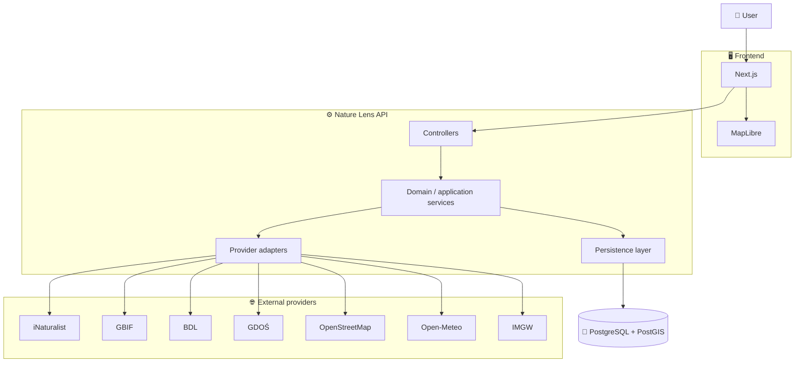
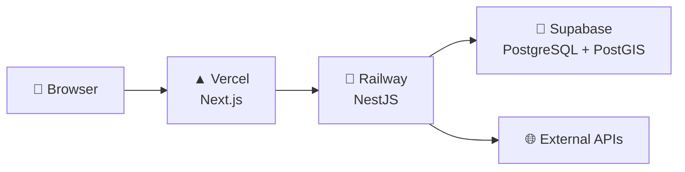

# 🏗️ Nature Lens Architecture

> **Status:** evolving architecture  
> **Scope:** current architectural direction, boundaries, and engineering decisions  
> **Principle:** start simple, add complexity only when the product creates a real need

---

## 🌲 Architecture at a glance

Nature Lens is a Poland-focused application that aggregates real biodiversity, forestry, environmental, weather, and geospatial data from multiple public sources.

The system is designed around two main product flows:

1. **Species → where and when was it observed in Poland?**
2. **Place → what nature data and observations are available here?**

The application starts as a **modular monolith** with a clear separation between:

- the Next.js frontend,
- the NestJS backend,
- the PostgreSQL/PostGIS database,
- external data providers.



This diagram represents the **direction of the system**, not a requirement to implement every provider immediately.

---

## 🎯 Architectural goals

The architecture should make it possible to:

- integrate multiple heterogeneous public APIs,
- keep provider-specific formats out of the rest of the application,
- expose one consistent API to the frontend,
- work effectively with geospatial data,
- tolerate partial provider failures,
- add caching and synchronization where they produce measurable value,
- keep the first versions understandable and deployable,
- support incremental development through small vertical slices.

The architecture should **not** optimize prematurely for hypothetical scale.

---

## 🧭 Core principles

### 1. Build vertical slices

New capabilities should preferably travel through the whole system:

```text
user interaction
      ↓
Next.js
      ↓
Nature Lens API
      ↓
domain/application logic
      ↓
provider and/or database
      ↓
response
      ↓
frontend
```

A small working feature is more valuable than several unfinished infrastructure layers.

---

### 2. Keep provider contracts at the boundary

External API response shapes must not become internal application models.

Bad direction:

```text
iNaturalist response type
        ↓
controller
        ↓
frontend
        ↓
UI components
```

Preferred direction:

```text
external response
       ↓
runtime validation
       ↓
provider adapter
       ↓
normalization
       ↓
Nature Lens model
       ↓
application/domain logic
```

This limits the impact of:

- provider contract changes,
- inconsistent field names,
- missing data,
- different coordinate formats,
- provider-specific identifiers,
- replacing or combining providers later.

---

### 3. The frontend primarily talks to our API

The frontend should not become an orchestration layer for many external systems.

Avoid:

```text
Next.js
├── iNaturalist
├── GBIF
├── BDL
├── GDOŚ
├── IMGW
└── Open-Meteo
```

Prefer:

```text
Next.js
    ↓
Nature Lens API
    ↓
providers + database
```

Benefits include:

- one stable contract for the frontend,
- centralized validation,
- centralized error handling,
- simpler caching,
- easier provider replacement,
- better control over rate limits,
- clearer observability.

A direct frontend-to-provider request may still be acceptable in the future if there is a concrete reason, but it should be an explicit exception.

---

### 4. Prefer a modular monolith

The NestJS backend starts as a **modular monolith**.

Reasons:

- the product is developed as one system,
- the team is small,
- deployment stays simple,
- module boundaries are sufficient for current complexity,
- transactions and shared persistence remain straightforward,
- distributed-system complexity would provide little value at this stage.

Microservices should not be introduced because they are fashionable or interview-friendly.

They become worth discussing only if real boundaries emerge, such as:

- independently scaling workloads,
- long-running ingestion pipelines,
- clearly separated ownership,
- strong deployment independence,
- materially different availability requirements.

---

### 5. Prefer explicit boundaries over speculative abstractions

Patterns should exist because they protect an actual boundary or solve a real problem.

Good reasons for abstraction:

- external provider differences,
- persistence access,
- runtime validation,
- cross-cutting HTTP behavior,
- repeated spatial-query logic.

Poor reasons:

- "we may need it someday",
- making the project look more enterprise,
- adding design patterns before there is variation.

---

## 🖥️ Frontend architecture

### Technology

The frontend uses:

- Next.js 16,
- React,
- TypeScript,
- App Router,
- Tailwind CSS,
- shadcn/ui,
- MapLibre.

### Server Components first

Server Components should remain the default where they fit naturally.

Client Components are introduced where browser capabilities or interactivity require them, for example:

- MapLibre,
- map movement,
- local interactive filters,
- browser event handlers,
- client-side state.

The goal is not to maximize either Server or Client Components, but to place work at the correct boundary.

---

### Data fetching

The frontend should fetch data through the Nature Lens API.

Different page sections may have different availability and latency characteristics.

For example:

```text
Species header          ✓
Observation summary     ✓
Map                     loading...
Seasonality             loading...
Provider metadata       error
```

The UI should support **progressive loading** rather than waiting for every source to finish before rendering useful content.

---

### Map architecture

MapLibre is responsible for visualization and interaction.

The frontend should not load an unlimited dataset and filter everything in the browser.

As the project evolves, map queries should use concepts such as:

- viewport bounding box,
- zoom level,
- date range,
- selected species,
- clustering,
- server-side spatial filtering.

A future map interaction may look like:

```text
user moves map
      ↓
move ends
      ↓
debounce / query decision
      ↓
bbox request
      ↓
PostGIS spatial query
      ↓
limited GeoJSON response
      ↓
MapLibre source update
```

Requests should not be fired for every pixel of map movement.

---

## ⚙️ Backend architecture

The backend uses Node.js and NestJS.

A conceptual request path is:

```text
Controller
    ↓
Application / domain service
    ↓
Repository and/or provider adapter
    ↓
Database / external API
```

Controllers should remain thin.

Their main responsibilities are:

- HTTP input,
- validation,
- invoking application logic,
- mapping results to the API response.

Business decisions should not accumulate in controllers.

---

## 📦 Backend modules

The exact module structure should evolve with the product.

Likely domain-oriented modules include:

```text
SpeciesModule
ObservationsModule
PlacesModule
```

Integration concerns may live in dedicated provider modules or infrastructure areas as needed.

The first vertical slice should remain much smaller, for example:

```text
SpeciesModule
└── SpeciesController
└── SpeciesService
└── INaturalistAdapter

ObservationsModule
└── ObservationsController
└── ObservationsService
```

Do not create empty modules for future providers before they are needed.

---

## 🔌 Provider adapters

Each external provider should be isolated behind an adapter when its data enters application logic.

Example:

```text
SpeciesService
      ↓
INaturalistAdapter
      ↓
iNaturalist API
```

A provider adapter is responsible for provider-specific concerns such as:

- endpoint URLs,
- query parameters,
- authentication if required,
- transport errors,
- provider response validation,
- mapping raw provider responses into small internal integration types.

Application services should not need to understand the original provider payload.

---

## 🛡️ Runtime validation

TypeScript types alone do not validate data received over the network.

External responses should therefore be validated at runtime at system boundaries.

Conceptually:

```text
unknown JSON
    ↓
runtime schema validation
    ↓
validated provider DTO
    ↓
normalization
```

Only the subset of the provider response actually required by the application should be modeled.

There is no benefit in reproducing a provider's entire API schema if the project uses ten fields.

---

## 🔄 Normalization

Nature Lens needs its own vocabulary and models.

For example, iNaturalist and GBIF may describe the same conceptual observation differently.

The normalization layer should resolve provider-specific differences before data reaches the rest of the application.

Typical normalized concepts include:

- species identity,
- scientific name,
- common/display name,
- observation date,
- provider,
- external identifier,
- coordinates,
- location precision,
- obscured/private location information,
- source URL.

Provider provenance must remain available after normalization.

We should always be able to answer:

> Where did this record come from?

---

## 🐘 Persistence

### PostgreSQL

PostgreSQL is the main application database.

It stores application-owned and normalized data.

### PostGIS

PostGIS extends PostgreSQL with geospatial capabilities.

It should be used for real spatial problems such as:

- observations inside a bounding box,
- observations within a radius,
- point-in-polygon queries,
- spatial joins,
- regional aggregation,
- map viewport queries.

Example:

```text
selected species
      +
current map bbox
      ↓
PostGIS
      ↓
matching observations
```

---

## 📍 Geospatial model

Observation locations are expected to use WGS84 coordinates (`SRID 4326`).

A conceptual observation record may include:

```text
Observation
├── id
├── speciesId
├── provider
├── externalId
├── observedAt
├── location: Point
├── positionalAccuracy
├── locationObscured
└── sourceUrl
```

The exact schema should be introduced through migrations and adjusted based on real provider data.

---

## 🔎 Spatial indexes

Spatial queries should use appropriate spatial indexes when query patterns justify them.

For observation points, a GiST index will likely be appropriate.

Indexes should correspond to actual query patterns rather than being added blindly.

Examples:

- provider + external ID uniqueness,
- species ID filtering,
- observation date filtering,
- spatial lookup on location.

---

## 💾 What should be stored vs fetched live?

This is an intentional architectural decision that will evolve as real usage becomes clear.

Not every external response should automatically be persisted.

Possible strategies include:

### Fetch live

Useful when:

- data changes frequently,
- requests are inexpensive,
- provider availability is acceptable,
- persistence adds little product value.

### Persist locally

Useful when:

- spatial querying is required,
- provider requests are expensive,
- historical analysis is needed,
- provider rate limits matter,
- data must be combined across sources,
- application availability should not depend entirely on the provider.

### Hybrid

Often the likely long-term direction:

```text
request
   ↓
local data available?
   ├── yes → return / refresh if necessary
   └── no  → provider → normalize → persist → return
```

The exact strategy should be chosen separately for each data type.

Do not build a generic synchronization platform before the first real synchronization problem exists.

---

## ⚡ Caching

Caching is expected to become important, but it should be introduced at the layer where it solves a measured problem.

Potential layers include:

- Next.js data cache,
- HTTP caching,
- database-backed cached provider data,
- in-memory backend cache,
- Redis later if there is a concrete multi-instance or workload need.

Redis is **not part of the initial architecture by default**.

---

## 🌐 External HTTP communication

External API calls should use a controlled backend HTTP layer.

Cross-cutting concerns include:

- timeout,
- provider identification,
- structured error mapping,
- logging,
- request duration,
- retry where safe,
- rate-limit handling.

Retries must not be applied automatically to every failure.

For example:

- a transient `503` may be retryable,
- malformed provider data is not,
- a client-side validation error is not,
- repeated retries against rate limiting may make the situation worse.

---

## 🚦 Failure model

External providers are assumed to fail sometimes.

Possible failures include:

- timeout,
- `5xx`,
- rate limit,
- malformed payload,
- changed API contract,
- unavailable records,
- partial data.

The system should avoid turning every provider issue into a complete page failure.

Conceptually:

```text
Page
├── species overview      ✓
├── observations          ✓
├── weather               error
└── protected areas       loading
```

Backend errors should be translated into stable application-level errors rather than leaking raw provider responses to the frontend.

---

## 📊 Observability

Observability should grow with the system.

Useful future signals include:

- API request duration,
- provider request duration,
- provider failure rate,
- validation failures,
- database query duration,
- slow spatial queries,
- cache hit rate,
- synchronization failures.

Logging should include enough context to answer questions such as:

> Which provider failed?

> For which operation?

> Was the failure transport-related, validation-related, or application-related?

Avoid logging sensitive data or unnecessary full provider payloads.

---

## 🛡️ Nature-data safety

Nature Lens works with real biodiversity observations.

The application must preserve restrictions imposed by data providers.

If a provider:

- obscures coordinates,
- reduces precision,
- hides a sensitive observation,

Nature Lens must not attempt to reverse or reconstruct that information.

Internally, the data model should preserve relevant metadata indicating that a location is obscured or imprecise.

Observation data must be presented as observational evidence, not certainty.

Preferred language:

> This species has been observed in this area.

Avoid:

> This species definitely occurs here.

---

## 🔐 Application security

The first public version may not require user authentication.

Security priorities still include:

- secret management through environment variables,
- runtime environment validation,
- input validation,
- query validation,
- safe database access,
- rate limiting where needed,
- avoiding provider credentials in frontend bundles,
- dependency updates,
- sensible CORS configuration.

Authentication should be introduced only when a real user-specific feature requires it.

---

## 🚀 Deployment architecture

The initial deployment direction is:



Expected responsibilities:

### Vercel

- Next.js application,
- frontend environment configuration,
- frontend deployment previews.

### Railway

- NestJS API,
- backend environment variables,
- health checks,
- runtime logs.

### Supabase

- PostgreSQL,
- PostGIS,
- database connection management,
- database backups and operational tooling provided by the platform.

This deployment model can change if the project creates a concrete reason to do so.

---

## 🧪 Testing strategy

Testing should reflect system boundaries.

### Unit tests

Best suited for:

- pure mapping logic,
- domain calculations,
- normalization,
- validation-related behavior,
- isolated application services.

### Integration tests

Best suited for:

- repositories,
- PostgreSQL behavior,
- PostGIS queries,
- NestJS modules,
- provider adapter behavior against mocked HTTP boundaries.

### E2E tests

Best suited for a small number of critical user journeys:

```text
search species
    ↓
open species
    ↓
load observations
    ↓
display map data
```

The goal is confidence, not maximizing test count.

---

## 📐 API design

The frontend should consume stable Nature Lens resources.

Examples may include:

```http
GET /api/species/search?q=deer
GET /api/species/:id
GET /api/species/:id/observations
```

Later:

```http
GET /api/species/:id/observations?bbox=...
GET /api/places/:id
GET /api/places/:id/observations
```

API contracts should be designed around product needs rather than mirroring provider endpoints.

---

## 📚 Documentation model

Architecture knowledge is split intentionally:

| Document                 | Responsibility                                                  |
| ------------------------ | --------------------------------------------------------------- |
| `README.md`              | What the project is and how to use the repository               |
| `ARCHITECTURE.md`        | How the system is structured and why                            |
| `PROJECT_STATE.md`       | Where implementation currently stands and which step is current |
| `IMPLEMENTATION_PLAN.md` | The step-by-step implementation roadmap                         |
| `AGENTS.md`              | How coding agents should work with the repository               |

Important architectural decisions discovered during implementation may later become dedicated ADRs.

For example:

```text
docs/
└── adr/
    ├── 001-modular-monolith.md
    ├── 002-provider-adapters.md
    └── 003-observation-storage-strategy.md
```

ADRs should be created for decisions worth preserving, not for every minor implementation choice.

---

## 🚫 Explicit non-goals for the initial architecture

The initial system does **not** require:

- microservices,
- Kubernetes,
- an event-driven architecture,
- Redis by default,
- message queues by default,
- GraphQL,
- a custom map server,
- a generic data lake,
- a full GIS platform,
- complex authentication,
- all providers integrated at once.

These technologies are not forbidden.

They simply require a real problem before they earn a place in the architecture.

---

## 🌱 Evolution strategy

Architecture should evolve through pressure from real features.

A typical sequence is:

```text
small vertical slice
        ↓
real limitation appears
        ↓
understand the limitation
        ↓
consider alternatives
        ↓
choose the smallest appropriate solution
        ↓
document the decision
```

Examples:

```text
too many repeated provider calls
        ↓
introduce caching
```

```text
slow viewport queries
        ↓
inspect query plan
        ↓
add / adjust spatial indexing
```

```text
provider instability hurts UX
        ↓
persist selected data
        ↓
introduce refresh strategy
```

```text
long-running synchronization becomes necessary
        ↓
consider background jobs / queues
```

This keeps the architecture connected to the actual product instead of turning the project into a catalogue of technologies.

---

## 🧠 Architecture decision checklist

Before introducing a significant architectural change, answer:

1. **What concrete problem are we solving?**
2. **Do we have evidence that the problem exists now?**
3. **What is the simplest viable solution?**
4. **What alternatives did we consider?**
5. **What complexity does this solution introduce?**
6. **How will we know whether it worked?**
7. **Does the decision need to be documented as an ADR?**

---

<div align="center">

## 🌲 Guiding principle

**First build the smallest working product slice.  
Then solve the next real problem.  
Only then introduce the abstraction or technology that earns its place.**

</div>
