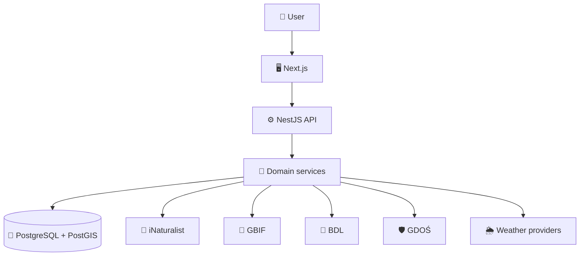

<div align="center">

# 🌲 Nature Lens

### Explore biodiversity and environmental data across Poland.

**Real observations. Real environmental data. One coherent interface.**

🌿 Biodiversity · 🦌 Species observations · 🗺️ Geospatial data · 🌦️ Environment · 🇵🇱 Poland

</div>

---

## 🌍 About the project

**Nature Lens** is a web application that brings together real biodiversity, environmental, forestry, weather, and geospatial data for Poland.

Useful nature data is currently scattered across many independent public APIs and open-data platforms. Each provider exposes different models, formats, spatial structures, update frequencies, and reliability characteristics.

Nature Lens aims to turn those fragmented sources into one consistent product.

The application is designed around two primary questions:

### 🦌 Species → Where and when was it observed?

For example:

> **Red deer — _Cervus elaphus_**

A user should eventually be able to explore:

- observation locations across Poland,
- observation history,
- seasonality,
- geographic distribution,
- regional patterns,
- basic species information.

### 🌲 Place → What nature data is available here?

For example:

> **Niepołomice Forest**

A user should eventually be able to explore:

- species observations,
- forests and forest stands,
- protected areas,
- environmental conditions,
- weather,
- selected infrastructure,
- spatial data displayed on an interactive map.

---

## ✨ Product principles

Nature Lens is not intended to be a portfolio application built around artificial datasets.

The project uses **real external data** and therefore has to deal with real engineering problems:

- 🔌 heterogeneous external APIs,
- 🧩 data normalization,
- 🗺️ geospatial data,
- 🐘 PostgreSQL and PostGIS,
- ⏱️ slow or unavailable providers,
- 🚦 rate limits,
- 💾 caching and synchronization,
- 🛡️ validation of external data,
- ⚡ progressive loading,
- 📊 spatial aggregation,
- 🔍 efficient map queries,
- 📡 observability and provider failures.

The architecture should evolve in response to actual product requirements rather than speculative complexity.

---

## 🧭 Current direction

The first complete vertical slice focuses on one simple product flow:

```text
Search for a species
        ↓
Find the species
        ↓
Load real observations from Poland
        ↓
Normalize and persist the data
        ↓
Expose it through the Nature Lens API
        ↓
Display observations on an interactive map
```

A representative example:

```text
"Red deer"
    ↓
Next.js
    ↓
Nature Lens API
    ↓
NestJS
    ↓
iNaturalist
    ↓
validation + normalization
    ↓
PostgreSQL / PostGIS
    ↓
API
    ↓
MapLibre
```

The first milestone deliberately stays small.

No microservices.  
No Redis without a real need.  
No seven-provider integration on day one.  
No giant GIS platform hiding inside a portfolio project.

---

## 🧱 Technology stack

| Area              | Technologies                                           |
| ----------------- | ------------------------------------------------------ |
| 🖥️ **Frontend**   | Next.js 16, React, TypeScript, Tailwind CSS, shadcn/ui |
| ⚙️ **Backend**    | Node.js, NestJS, REST API                              |
| 🐘 **Data**       | PostgreSQL, PostGIS, Supabase                          |
| 🗺️ **Maps**       | MapLibre, GeoJSON, spatial queries                     |
| ☁️ **Deployment** | Vercel, Railway, Supabase                              |

---

## 🏗️ Architecture

Nature Lens starts as a **modular monolith**.

The frontend primarily communicates with the Nature Lens backend rather than integrating with every external provider independently.



External providers are isolated behind adapters.

```text
SpeciesService
      ↓
INaturalistAdapter
      ↓
iNaturalist API
```

Provider-specific responses should not leak throughout the application.

Instead:

```text
external response
       ↓
runtime validation
       ↓
normalization
       ↓
Nature Lens model
       ↓
domain logic
```

This makes the application less dependent on the contracts of individual providers and creates a consistent API for the frontend.

---

## 🗺️ Geospatial data

Maps are a core part of the product, but Nature Lens is **not intended to become a general-purpose GIS platform**.

The project uses GIS concepts only where they solve actual product problems.

Examples include:

- geographic coordinates,
- GeoJSON,
- `Point`, `LineString` and `Polygon`,
- bounding boxes,
- spatial indexes,
- clustering,
- heatmaps,
- distance queries,
- point-in-polygon queries,
- spatial aggregation,
- PostGIS,
- WMS / WFS / OGC APIs.

A typical future query might look conceptually like:

```text
Find observations
inside the current map viewport
for a selected species
within a given date range
```

---

## 🌐 Data sources

Nature Lens is designed to integrate multiple public and open-data providers.

| Source               | Purpose                                                        |
| -------------------- | -------------------------------------------------------------- |
| 🦌 **iNaturalist**   | Recent biodiversity observations                               |
| 🌿 **GBIF**          | Large-scale and historical biodiversity occurrence data        |
| 🌲 **BDL**           | Polish forests, forest stands and forestry-related information |
| 🛡️ **GDOŚ**          | Protected areas, Natura 2000 and other nature protection data  |
| 🗺️ **OpenStreetMap** | Geographic context, paths, infrastructure and selected POIs    |
| 🌦️ **Open-Meteo**    | Weather and environmental conditions                           |
| 🇵🇱 **IMGW**          | Official Polish meteorological and hydrological data           |

Not every provider belongs in the first version.

Integrations should be introduced only when they support a concrete product requirement.

---

## ⚡ Progressive loading

Nature Lens depends on several independent external systems.

The UI should therefore avoid treating the page as one giant request.

Instead, individual sections can load independently:

```text
Overview              ✓
Map                   ✓
Species observations  loading...
Weather               ✓
Protected areas       error
Forest data           loading...
```

A temporary failure of one provider should not make the entire application unusable.

This makes partial failures a product concern as much as a backend concern.

---

## 🛡️ Responsible nature data

Biodiversity data represents **observations**, not certainty.

The application should communicate:

> “This species has been observed in this area.”

rather than:

> “This species definitely occurs here.”

Nature Lens must also respect provider rules regarding protected, threatened, and sensitive species.

If a data source obscures or reduces the precision of a location, the application will **not attempt to reconstruct the hidden coordinates**.

The project will also not provide mushroom-edibility decisions or other safety-critical species identification advice.

---

## 📦 Repository structure

The repository uses a small pnpm workspace. The frontend runs a minimal Next.js application; the backend currently contains only a package manifest.

```text
nature-lens/
│
├── web/                    # Next.js frontend (App Router)
├── api/                    # Future NestJS backend
│
├── README.md
├── ARCHITECTURE.md
├── PROJECT_STATE.md
├── AGENTS.md
├── IMPLEMENTATION_PLAN.md
│
├── package.json
├── pnpm-lock.yaml
└── pnpm-workspace.yaml
```

The structure will evolve only when the project creates a concrete need for additional packages or boundaries.

With pnpm 12.4.1 installed (the version pinned in `package.json`), install dependencies from the repository root:

```bash
pnpm install
```

If pnpm is not on your PATH, you can run the same command through npm:

```bash
npm exec --yes --package=pnpm@12.4.1 -- pnpm install
```

Start the frontend from the repository root:

```bash
pnpm dev:web
```

Open http://localhost:3000 to view the Nature Lens welcome page. It is a static starting point; species search and observation data will be added in later steps.

Frontend commands, also run from the repository root:

```bash
pnpm --filter web typecheck
pnpm --filter web build
pnpm --filter web start
```

`start` serves the production build, so run `build` first. `typecheck` generates Next.js route types before checking TypeScript, including on a fresh checkout.

The frontend uses Next.js 16, React 19, TypeScript, and Tailwind CSS 4. In `web/app/`, `layout.tsx` defines the HTML document and metadata, `page.tsx` renders `/`, and `globals.css` imports Tailwind. The layout and page are Server Components by default; no client-side interaction is needed yet.

Shared linting and formatting will be configured in step 04. No application test suite exists yet.

---

## 🚦 Project status

> 🟡 **Status: early development / frontend bootstrap**

The project is being built incrementally through small, working vertical slices.

The first major milestone is:

### 🦌 Species observations on a map

A user can:

1. search for a species,
2. select a result,
3. open its species page,
4. see real observations from Poland,
5. explore those observations on an interactive map.

After that foundation works end-to-end, additional providers and environmental datasets can be introduced.

---

## 🧪 Engineering goals

Besides building a useful product, Nature Lens serves as a practical environment for exploring production-oriented engineering topics.

### Frontend

- React architecture
- Next.js App Router
- Server and Client Components
- data fetching
- loading and error states
- TypeScript
- performance
- interactive maps

### Backend

- NestJS architecture
- REST API design
- external API integrations
- dependency injection
- adapter pattern
- runtime validation
- error handling
- caching
- rate limiting

### Data

- PostgreSQL
- SQL
- PostGIS
- spatial indexes
- spatial queries
- data normalization

### Engineering

- unit tests
- integration tests
- E2E tests
- Docker
- CI/CD
- observability
- deployment
- resilience
- system design

---

## 📚 Project documentation

More detailed project knowledge lives outside this README.

| Document                    | Purpose                                                              |
| --------------------------- | -------------------------------------------------------------------- |
| 🏗️ `ARCHITECTURE.md`        | Architecture, system boundaries and important technical decisions    |
| 📍 `PROJECT_STATE.md`       | Current implementation state and current-step pointer                |
| 🧭 `IMPLEMENTATION_PLAN.md` | Full implementation roadmap used step by step                        |
| 🤖 `AGENTS.md`              | Instructions and context for coding agents working in the repository |

The README describes **what Nature Lens is**.

`ARCHITECTURE.md` explains **why the system is designed the way it is**.

`PROJECT_STATE.md` answers **where the implementation currently stands and what the current step is**.

`IMPLEMENTATION_PLAN.md` defines **what should be built, step by step**.

`AGENTS.md` defines **how coding agents should work with the repository**.

---

<div align="center">

### 🌲 Nature Lens

**Real nature data. Clear engineering decisions. One step at a time.**

</div>
